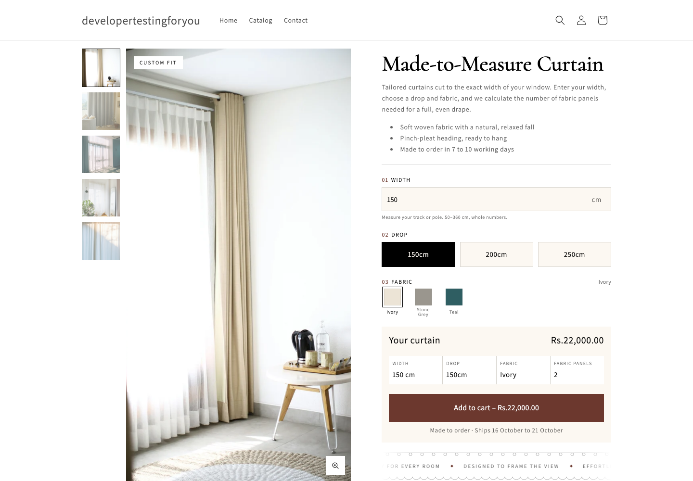

# Made-to-Measure Curtain Configurator

A product page section for Shopify's Dawn theme (16.0.0). The customer types a width, picks a drop and a fabric, and the price updates as they go. Behind the scenes the section works out how many fabric panels the curtain needs, adds the matching hidden variant to the cart, and saves the panel count on the order.

Prices and width ranges are stored in a metaobject, not in the code.

## Live preview

- Store: https://developertestingforyou.myshopify.com/products/made-to-measure-curtain
- Password: `smile`



## Files

| File | What it does |
| --- | --- |
| `sections/curtain-configurator.liquid` | The section: gallery, form blocks, summary card and settings |
| `assets/curtain-configurator.js` | The `<curtain-configurator>` element: pricing, variant matching, add to cart, zoom, accordion |
| `assets/curtain-configurator.css` | Styles for this section only |
| `snippets/curtain-swatch.liquid` | One fabric swatch |
| `snippets/curtain-trust-icon.liquid` | Icons for the trust badges |
| `templates/product.curtain.json` | The product template that uses the section |
| `schema/` | Metaobject export and example cart data |
| `tests/e2e/` | Playwright test for the whole flow |

Everything else is stock Dawn. The few Dawn files that were changed are listed near the end.

## Setup on a new store

**1. Metaobject.** In Settings > Custom data > Metaobjects, add a definition called `Curtain Pricing Tier` with the type `curtain_pricing_tier`. Turn on storefront access. Add these fields, all required:

| Field | Type |
| --- | --- |
| `min_width` | Integer (cm) |
| `max_width` | Integer (cm) |
| `panels_required` | Integer |
| `base_price` | Decimal |
| `price_per_drop_tier` | Decimal |

Prices are decimals, not money fields, because the script does maths on them. The theme formats the result in the shop's currency. The same definition is in `schema/curtain-pricing-tier.json` if you'd rather create it with the Admin API.

**2. Tiers.** Add one entry per width range:

| Width (cm) | Panels | Base price | Per drop step |
| --- | --- | --- | --- |
| 50 to 120 | 1 | 12,000 | 2,500 |
| 121 to 240 | 2 | 22,000 | 4,500 |
| 241 to 360 | 3 | 32,000 | 6,500 |

Ranges shouldn't overlap or leave gaps. The width input takes its minimum and maximum from these entries, so adding a tier widens it automatically.

**3. Product metafield.** In Settings > Custom data > Products, add `custom.pricing_tiers` with the type "Metaobject, list", limited to Curtain Pricing Tier. Turn on storefront access.

**4. Product.** Create the product with three options, in this order:

- Color: Ivory, Stone Grey, Teal
- Drop: 150cm, 200cm, 250cm
- Panels: 1, 2, 3. This option is never shown to the customer.

That makes 27 variants. Price each one with the formula below. Then link the three tiers in the product's metafield, set the theme template to `curtain`, and turn off inventory tracking, since everything is made to order. Give each variant its color's image so the gallery follows the swatch.

**5. Theme.** Push the theme with `shopify theme push --unpublished`. In Theme settings > Cart, set the cart type to Drawer. In the theme editor, the swatch values in the Fabric picker block must match the product's Color values exactly.

## How the price works

```
panels = panels_required of the tier the width falls in
step   = position of the chosen drop (150cm = 0, 200cm = 1, 250cm = 2)
price  = base_price + price_per_drop_tier × step
```

For example, take a width of 180 cm, a 200cm drop and Stone Grey. 180 cm falls in the 121 to 240 tier, so it needs 2 panels. The 200cm drop is step 1. The price is 22,000 + 4,500 × 1 = Rs 26,500. The script adds the variant Stone Grey / 200cm / 2, which is priced at Rs 26,500.

The script calculates in cents and compares the result with the variant's price before adding to cart. If they don't match, the button is disabled and a warning is logged in the console.

## Add to cart

The script sends one request to `/cart/add.js`:

```json
{
  "id": 67634407407803,
  "quantity": 1,
  "properties": { "Width": "180cm", "Drop": "200cm", "_fabric_panels": 2 },
  "sections": ["cart-drawer", "cart-icon-bubble"],
  "sections_url": "/products/made-to-measure-curtain"
}
```

Why it's built this way:

- The panel count is a real variant, kept hidden, because Shopify charges the variant price. A line item property can't change the price without a Cart Transform function. Each panel count also gets its own SKU for the workroom.
- `Width` and `Drop` are normal properties, so the customer sees them in the cart and at checkout. `_fabric_panels` starts with an underscore, so Dawn and checkout hide it, but it still shows on the order in the admin.
- The body is JSON built from the validated values, not read from the form. That also keeps `_fabric_panels` as a number.
- `sections` and `sections_url` make Shopify return the updated cart drawer and cart icon in the same response, using the Section Rendering API. The script passes them to Dawn's own `renderContents()`. If the page has no drawer, it sends the customer to `/cart` instead.

`schema/example-cart-line.json` shows the cart line that comes back.

## Keeping prices in sync

The storefront calculates prices from the metaobject, but checkout charges the variant price. When you change a tier, update the matching variant prices as well, for example with `productVariantsBulkUpdate` or a Shopify Flow workflow. Until you do, the affected combinations show a disabled button, so nobody is charged the wrong amount.

To add a tier, add the entry, link it on the product, then add a new Panels value with its variants.

## Theme editor

The product column is made of blocks that can be reordered or removed: vendor, title, description, width, drop, fabric picker with up to six swatches, price and add to cart, marquee, trust badges and collapsible rows. The step numbers 01, 02 and 03 follow the block order.

A few things worth knowing:

- In the add to cart block, the note can use `[start]` and `[end]`. The script swaps them for real dates, counting working days by default. This happens in the browser because Shopify can serve a cached page from an earlier day.
- Section settings cover the image badge, zoom, colors, fonts, spacing, the container width (1440px) and the option names, in case a product uses "Colour" or "Length".
- On desktop the gallery takes 60% of the width, with a full-height main image and thumbnails on the left. On mobile the main image runs edge to edge.

## Dawn changes

| File | Change |
| --- | --- |
| `config/settings_data.json` | Cart type set to drawer |
| `snippets/cart-drawer.liquid` | Four lines that hide the Panels option and the duplicate Drop on curtain lines |
| `sections/main-cart-items.liquid` | The same four lines, for the cart page |

Dawn already hides properties that start with an underscore, so `_fabric_panels` needed no change.

## Testing

```bash
cd tests/e2e
npm install
npx playwright install chromium
STORE_URL=https://your-store.myshopify.com STORE_PASSWORD=... THEME_ID=123456789 npm test
```

It runs 65 checks against a theme preview. They cover the price at every tier edge, width validation, the cart request, the drawer and cart page, hidden properties, layout shift, the mobile layout, zoom, the accordion, and what happens when the cart request fails.

## Notes

- The layout doesn't shift as prices and messages change, because their space is reserved from the start. Dawn hides empty `div` and `p` elements, so the CSS forces the empty placeholders to stay visible.
- Every input has a label. Swatches and drops are radio groups, so arrow keys work. The price is announced to screen readers when it changes.
- Checkout and order emails still show the full variant title, such as "Stone Grey / 200cm / 2". Hiding that needs checkout customization.
- The variant count is colors × drops × tiers. That's fine up to Shopify's limit of 2,048 variants per product.
- The product photos are from Unsplash.
